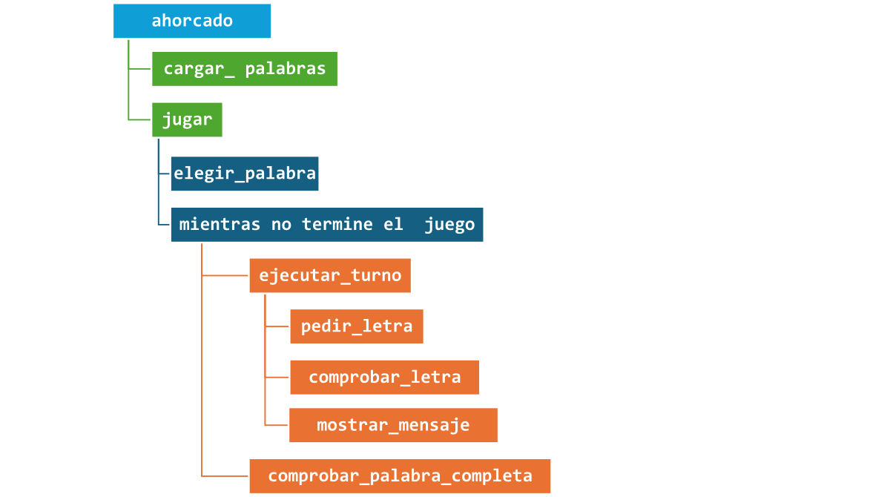

# Ejercicio de laboratorio: Ahorcado
**Autor**: Fernando Enríquez  **Revisores**: Fermín Cruz, Toñi Reina   **Fecha última modificación**: 29/09/2026

En este proyecto vamos a implementar el juego del "Ahorcado". Empezaremos implementando funciones para resolver diferentes partes del juego, y después implementaremos la mecánica del juego haciendo uso de dichas funciones. 

El juego consiste en adivinar la palabra que nos propone el ordenador, que se nos mostrará en pantalla "enmascarando" las letras sustituyendo cada letra por un guión bajo. El jugador irá proponiendo letras que podrán estar o no incluidas en la palabra secreta u oculta. Si la letra propuesta está incluida se hará visible en las posiciones en las que aparezca dentro de la palabra, y si no, se sumará un fallo al contador de intentos fallidos. El juego terminará cuando se cumpla una de las siguientes condiciones:

* El jugador ha "destapado" todas las letras de la palabra que hay que adivinar, ganando la partida.
* El jugador ha alcanzado el número máximo de intentos fallidos, perdiendo la partida.

### Preparación del proyecto

Observe que el proyecto contiene una carpeta ``src``, dentro de la cual deberá crear el módulo principal ``ahorcado.py``, que acompañará al módulo de test ``ahorcado_test.py`` que se proporciona ya completo para facilitar las pruebas.

### Estructura general del proyecto

Antes de empezar a implementar los siguientes ejercicios, es útil tener una idea de las piezas principales que vamos a construir. El juego del Ahorcado es un problema complejo, y para resolverlo conviene descomponerlo en funciones que resuelven tareas concretas. Una posible descomposición es la siguiente:

#### Funciones para la gestión de palabras

- `cargar_palabras(ruta)`: lee la lista de palabras desde un fichero.
- `elegir_palabra(palabras)`: selecciona una palabra secreta al azar.

#### Funciones para la representación de la palabra secreta

- `enmascarar_palabra(palabra, letras_probadas)`: muestra la palabra con guiones bajos y las letras ya adivinadas.

#### Funciones para la interacción con el usuario

- `pedir_letra(letras_probadas)`: solicita una nueva letra al jugador, asegurándose de que sea válida.
- `mostrar_mensaje(acierto)`: informa si la letra se acertó o no.

#### Funciones que se encargan de realizar comprobaciones del juego

- `comprobar_letra(palabra_secreta, letra)`: verifica si la letra está en la palabra.
- `comprobar_palabra_completa(palabra_secreta, letras_probadas)`: indica si la palabra ya se completó.

#### Funciones que controlan la dinámica de la partida

- `ejecutar_turno(palabra_secreta, letras_probadas)`: realizar un turno de juego.
- `jugar(max_intentos, palabras)`: gestiona toda la partida hasta ganar o perder.


Para que te hagas una idea de cómo se relacionan estas funciones, puedes echarle un vistazo al siguiente diagrama en el que puedes ver la relación entre las mismas. Las ramas del árbol representan relaciones entre las funciones.



Los ejercicios que se van pidiendo a continuación seguirán este orden: primero implementaremos y probaremos funciones sencillas de apoyo, y después las combinaremos para dar lugar a la mecánica completa del juego. De esta manera, cada paso tendrá sentido dentro de un todo mayor.


### Ejercicio 1: Implementación de funciones

#### Apartado a

Añada al módulo ``ahorcado.py`` una función ``cargar_palabras`` que reciba la ruta a un fichero de texto que contenga una palabra en cada línea y devuelva una lista con dichas palabras. Se proporciona a continuación la implementación de esta función:

```python
def cargar_palabras(ruta):
    ''' 
    Recibe la ruta de un fichero de texto que contiene una palabra por línea y devuelve
    dichas palabras en una lista.    
    
    :param ruta: Ruta de un fichero de texto. El fichero debe contener una palabra por línea.
    :type ruta: str
    :return: Una lista con las palabras leías del fichero
    :rtype: list[str]
    '''
    
    with open(ruta, encoding='utf-8') as f:
        res = []
        for linea in f:
            res.append(linea.strip()) # strip() elimina los espacios en blanco y saltos de línea al principio y al final
        return res

```

Descomente la llamada a ``test_cargar_palabras`` en el módulo ``ahorcado_test.py`` y ejecute el módulo. Debe observar por consola lo siguiente:

```
Testeando cargar_palabras()... 
Palabras cargadas: 505
Primeras 3 palabras: ['python', 'programacion', 'computadora']
Últimas 3 palabras: ['mundo', 'casa', 'diente']
```

#### Apartado b

Añada al módulo ``ahorcado.py`` una función ``elegir_palabra`` que reciba una lista de palabras y devuelva una de ellas seleccionada al azar. Puede usar la siguiente plantilla para definir la función y sustituir `pass` por el código que complete la tarea:

```python
def elegir_palabra(palabras):
    '''
    Elige la palabra a adivinar:
    - Selecciona una palabra aleatoria de la lista 'palabras'
    - Devuelve la palabra seleccionada
    Ayuda: 
    - La función 'random.choice' del paquete 'random' recibe una lista de opciones y 
      devuelve una de ellas seleccionada aleatoriamente.

    :param palabras: Lista con las palabras a seleccionar
    :type palabras: list[str]
    :return: La palabra seleccionada
    :rtype: str
    '''
    pass
```
Vuelva a comentar la llamada a ``test_cargar_palabras`` en el módulo ``ahorcado_test.py`` y descomente ahora la llamada a ``test_elegir_palabra``, así como la línea anterior que carga la lista de palabras en la variable ``PALABRAS``, ya que se necesita esta variable para dicha llamada. 

Ejecute el módulo ``ahorcado_test.py``. El programa mostrará la palabra seleccionada aleatoriamente entre las que componen la lista de palabras leída del fichero. Si se ejecuta varias veces podremos ver como la palabra seleccionada va cambiando en cada ejecución, obteniendo una salida similar a la siguiente:


    Testeando elegir_palabra()... 
    Palabra elegida: esquina

    Testeando elegir_palabra()... 
    Palabra elegida: sueño

    ...


#### Apartado c

Añada al módulo ``ahorcado.py`` una función ``enmascarar_palabra`` que reciba la palabra secreta que se pretende adivinar y el conjunto de letras que el usuario ha ido probando hasta ahora, y devuelva la palabra "enmascarada", es decir, mostrando solo aquellas letras que estén entre las que ya se han probado y sustituyendo el resto por `'_'`. Para que las letras que componen la palabra sean más legibles, la función insertará un espacio entre cada par de letras. 

Puede usar la siguiente plantilla para definir la función y sustituir `pass` por el código que complete la tarea:

```python
def enmascarar_palabra(palabra, letras_probadas):
    '''
    Enmascarar la palabra:
    - Inicializar una lista vacía. 
    - Recorrer cada letra de la palabra, añadiendola a la cadena resultado 
      si forma parte de las letras_probadas, o añadiendo un '_' en caso contrario. 
    - Devuelve una cadena con la palabra enmascarada.
    
    :param palabra: Palabra que se quiere enmascarar
    :type palabra: str
    :param letras_probadas: Conjunto con las letras que ya se han probado
    :type letras_probadas: set[str]
    :return: La palabra original en la que las letras que no se han probado
       aparecen enmascaradas con un _.
    :rtype: str
    '''
    pass
```

Descomente las llamadas a ``test_enmascarar_palabra`` en el módulo ``ahorcado_test.py`` comentando las anteriores. Observe que hemos añadido varias llamadas para probar diferentes combinaciones posibles de letras probadas para la palabra `python`. Ejecute el módulo y deberá obtener la siguiente salida:

```
Testeando enmascarar_palabra() con la palabra 'python' y las letras ()...
Palabra enmascarada: _ _ _ _ _ _

Testeando enmascarar_palabra() con la palabra 'python' y las letras (p,y,o,t,h,n)...
Palabra enmascarada: p y t h o n

Testeando enmascarar_palabra() con la palabra 'python' y las letras (e,b,d,a,c)...
Palabra enmascarada: _ _ _ _ _ _

Testeando enmascarar_palabra() con la palabra 'python' y las letras (e,u,o,i,a)...
Palabra enmascarada: _ _ _ _ o _
```

#### Apartado d

Añada al módulo ``ahorcado.py`` una función ``pedir_letra`` que reciba el conjunto de letras probadas hasta el momento y le pida al usuario que escriba una nueva letra a probar. Si el usuario escribe una letra que ya ha sido probada anteriormente se le volverá a pedir que escriba otra diferente una y otra vez hasta que lo haga, y finalmente se devolverá la letra indicada. Puede usar la siguiente plantilla para definir la función y sustituir `pass` por el código que complete la tarea:

```python
def pedir_letra(letras_probadas):
'''
    Pedir la siguiente letra:
    - Pedirle al usuario que escriba la siguiente letra por teclado
    - Comprobar si la letra indicada es válida (tiene un solo caracter, es un caracter alfabético y no es una de las letras ya introducidas)
    - Mientras que la letra introducida no sea una letra válida, mostrar un mensaje de error y volver a pedir la letra
    - Considerar las letras en minúsculas aunque el usuario las escriba en mayúsculas
    - Devolver la letra
    Ayuda:
    - La función 'input' permite leer una cadena de texto desde la entrada estándar
    - El método 'lower' aplicado a una cadena devuelve una copia de la cadena en minúsculas
    - Defina dos funciones auxiliares:
        * letra_valida, que dado el conjunto de letras probadas y la letra introducida,
          devuelve True si la letra es válida, y False en caso contrario.
        * mensaje_error, que dados el conjunto de letras probads y una letra, devuelve un mensaje de error indicando,
          el motivo por el que la letra no es válida. Los mensajes de error deben ser:
               -  "Solo puedes introducir una letra. ", no tiene exactamente un caracter.
               -  "Debes introducir un carácter alfabético. ", si no introduce una letra.
               -  "Ya has introducido esa letra antes. ", si el problema es que ya introdujo esa letra.
    else:
        msg = "Ya has introducido esa letra antes. "
    :param letras_probadas: Conjunto con las letras que ya se han probado
    :type letras_probadas: set[str]
    :return: La letra que el usuario quiere probar
    :rtype: str
    '''
    pass
```

Descomente la llamada a ``test_pedir_letra`` en el módulo ``ahorcado_test.py`` comentando las anteriores. Observe que hemos añadido una llamada a esta función con el conjunto de letras `a, b y c` para poder probar la función en los casos en los que introducimos una de estas letras o una letra diferente. Ejecute el módulo y pruebe a introducir diferentes letras, por ejemplo, si seguimos la secuencia `a, b, c, d` se producirá la siguiente salida:

```
Testeando pedir_letra() con las letras (c,a,b)... 
Adivina una letra: a
Ya has probado con esa letra. Intenta con otra: b
Ya has probado con esa letra. Intenta con otra: c
Ya has probado con esa letra. Intenta con otra: d
Letra introducida: d
```

#### Apartado e

Añada al módulo ``ahorcado.py`` una función ``comprobar_letra`` que reciba la palabra secreta y la letra que queremos comprobar si forma parte de la palabra o no. La función devolverá ``True`` en el caso de que así sea, o ``False`` en caso contrario. Añada también una función ``mostrar_mensaje`` que reciba una variable booleana que indique si el usuario ha acertado la letra, y muestre por la consola un mensaje en consonancia. Puede usar la siguiente plantilla para definir las funciones y sustituir `pass` por el código que complete la tarea:

```python
def comprobar_letra(palabra_secreta, letra):
    '''   
    Comprobar letra:
    - Comprobar si la letra está en la palabra secreta o no
    - Devolver True si estaba y False si no

    :param palabra_secreta: Palabra que se intenta adivinar
    :type palabra_secreta: str
    :param letra: letra que ha introducido el usuario
    :type letra: str
    :return: True si la letra está en la palabra
    :rtype: bool
    '''
    pass

    def mostrar_mensaje (acierto):
    '''
    Mostrar mensaje:
     - Muestra por la consola el mensaje "¡Bien hecho! Esa letra está en la palabra.",
    si acierto tiene el valor True. 
    -  Muestra por la consola el mensaje "Lo siento, esa letra no está en la palabra."
    si acierto tiene el valor False.

    :param acierto: Es True si el usuario ha acertado la letra, y False en caso contrario
    :type acierto: bool
    '''
    pass
```

Descomente las llamadas a ``test_comprobar_letra`` en el módulo ``ahorcado_test.py`` comentando las anteriores. Observe que hemos añadido dos llamadas a esta función para probar los dos casos posibles, aquel en el que la letra forma parte de la palabra y aquel en el que no es así. Ejecute el módulo y deberá obtener la siguiente salida:

```
Testeando comprobar_letra() con la palabra 'python' y la letra 'p'... 
¡Bien hecho! Esa letra está en la palabra.
Resultado: Acierto

Testeando comprobar_letra() con la palabra 'python' y la letra 'a'...
Lo siento, esa letra no está en la palabra.
Resultado: Fallo
```

#### Apartado f

Añada al módulo ``ahorcado.py`` una función ``comprobar_palabra_completa`` que reciba la palabra secreta y el conjunto de letras probadas devolviendo ``True`` si ya se han adivinado todas las letras de la palabra o ``False`` si quedan una o más letras de la palabra sin adivinar. Puede usar la siguiente plantilla para definir la función y sustituir `pass` por el código que complete la tarea:

```python
def comprobar_palabra_completa(palabra_secreta, letras_probadas):
    '''
    Comprobar si se ha completado la palabra:
    - Comprobar si todas las letras de la palabra secreta han sido propuestas por el usuario
    - Devolver True si es así o False si falta alguna letra por adivinar
    :param palabra_secreta: Palabra que se tiene que adivinar
    :type palabra_secreta: str
    :param letras_probadas: Conjunto con las letras que ya se han probado
    :type letras_probadas: set[str]
    :return: Devuelve True si se han adivinado todas las letras de la palabra, y False en caso contrario
    :rtype: bool
    '''
    pass
```

Descomente las llamadas a ``test_compobar_palabra_completa`` en el módulo ``ahorcado_test.py`` comentando las anteriores. Observe que hemos añadido varias llamadas a esta función para probar diferentes combinaciones posibles de letras probadas para la palabra `python`. Ejecute el módulo y deberá obtener la siguiente salida:

```
Testeando comprobar_palabra_completa() con la palabra 'python' y las letras (y,o,t,h,p,n)... 
Resultado: Completa

Testeando comprobar_palabra_completa() con la palabra 'python' y las letras (c,e,b,d,a)...
Resultado: Incompleta

Testeando comprobar_palabra_completa() con la palabra 'python' y las letras ()...
Resultado: Incompleta
```

#### Apartado g

Añada al módulo ``ahorcado.py`` una función ``ejecutar_turno`` que reciba la palabra secreta y el conjunto de letras probadas hasta el momento y realice un turno del juego mostrando la palabra "enmascarada", pidiéndole al usuario una nueva letra y devolviendo ``True`` si dicha letra es un acierto o ``False`` si no. También deberá añadir dicha nueva letra al conjunto de letras probadas. Puede usar la siguiente plantilla para definir la función y sustituir `pass` por el código que complete la tarea:

```python
def ejecutar_turno(palabra_secreta, letras_probadas):
    '''
    Ejecutar un turno de juego:
    - Mostrar la palabra enmascarada
    - Pedir la nueva letra
    - Añadir la letra al conjunto de letras probadas
    - Comprobar si la letra está en la palabra (acierto) o no (fallo)
    - Mostrar mensaje indicando acierto/fallo
    - Devolver True si la letra fue un acierto, False si fue un fallo
    Ayuda:
    - Recuerda las funciones que ya has implementado para mostrar la palabra, pedir la letra y comprobarla

    :param palabra_secreta: palabra que el usuario tiene que adivinar
    :type palabra_secreta: str
    :param letras_probadas: conjunto con las letras que el usuario ya ha probado
    :type letras_probadas: set [str]
    :return: True si el usuario ha adivinado la palabra, y False en caso contraro
    :rtype: bool
    '''
    pass
```

Descomente las llamadas a ``test_ejecutar_turno`` en el módulo ``ahorcado_test.py`` comentando las anteriores. Observe que hemos añadido un par de llamadas a esta función para probar con una letra que esté en la palabra y con otra que no. Además, si escribe una letra que ya se probó anteriormente debe volver a pedirnos una letra distinta como se vió antes al probar la función ``test_pedir_letra``. Ejecute el módulo y según la letra que escriba obtendrá un resultado u otro. Por ejemplo, si escribe las letras `a`, `f` en la primera llamada y `n` en la segunda, deberá obtener la siguiente salida:

```
Testeando ejecutar_turno() con la palabra 'python' y las letras (d,c,b,a,e)... 
Palabra: _ _ _ _ _ _
Adivina una letra: a
Ya has probado con esa letra. Intenta con otra: f
Lo siento, esa letra no está en la palabra.
Resultado: Fallo

Testeando ejecutar_turno() con la palabra 'python' y las letras (p,o,t,y,h)...
Palabra: p y t h o _
Adivina una letra: n
¡Bien hecho! Esa letra está en la palabra.
Resultado: Acierto
```

### Ejercicio 2

#### Apartado a

Implemente en el módulo ``ahorcado.py`` una función ``jugar``, que recibe el número máximo de intentos permitidos y la lista de palabras de la que se seleccionará aleatoriamente la palabra secreta a adivinar.Puede usar la siguiente plantilla para definir la función y sustituir `pass` por el código que complete la tarea:

```python
def jugar(max_intentos, palabras):
    '''
      Completar una partida hasta que el jugador gane o pierda:
    - Mostrar mensaje de bienvenida
    - Elegir la palabra secreta a adivinar
    - Inicializar las variables del juego (letras probadas e intentos fallidos)
    - Ejecutar los turnos de juego necesarios hasta finalizar la partida, y en cada turno:
      > Averiguar si ha habido acierto o fallo
      > Actualizar el contador de fallos si es necesario
      > Comprobar si se ha superado el número de fallos máximo
      > Comprobar si se ha completado la palabra
      > Mostrar el mensaje de fin adecuado si procede o el número de intentos restantes

    :param max_intentos: Número máximo de intentos que el usuario tiene para adivinar la palabra
    :type max_intentos: int
    :param palabras: lista de palabras para adivinar
    :type palabras: list[str]
    '''
    pass
```

Añada el siguiente código al final del módulo ``ahorcado.py``:

```python
# Iniciar el juego
if __name__ == "__main__":
    palabras = cargar_palabras("data/palabras_ahorcado.txt")
    jugar(6, palabras)
```

De esta forma, al ejecutar el módulo ``ahorcado.py`` se invocará a la función ``jugar`` y se iniciará el juego. Ejecute el módulo.

#### Apartado b

Piensa en posibles mejoras para esta implementación. Por ejemplo, ¿qué pasa si el usuario en lugar de una letra escribe cualquier otra cosa?

### Ejercicio 3 (avanzado)

Se quiere implementar una versión del juego que permita jugar con palabras con tildes. Es decir, si la palabra secreta tuviese una letra con tilde, al escribir el usuario esa misma letra pero sin tilde se consideraría un acierto. 

Tenga en cuenta que al mostrar la palabra deben mostrarse las letras como son, es decir, si la palabra es ``programación`` y el usuario escribe la letra ``o``, se dará por buena para ambas ocurrencias de esa letra, tanto con tilde como sin tilde, pero al mostrar la palabra se mostrará con la letra ``ó`` donde corresponda, por ejemplo ``_ _ o _ _ _ _ _ _ _ ó _``.

Para probar las modificaciones realizadas puede utilizar el fichero ``palabras_ahorcado_conTildes.txt`` que encontrará en la carpeta ``data`` y que contiene palabras con tilde.

### Interfaz gráfica

Como curiosidad, se proporciona también una interfaz gráfica sencilla para el juego, que utilizará las funciones que ha implementado anteriormente. Es una interfaz sencilla desarrollada con la librería Tkinter de Python.


Una vez haya completado todas las funciones del ejercicio 1, ejecute el fichero ``ahorcadoGUI.py`` y compruebe el resultado.
